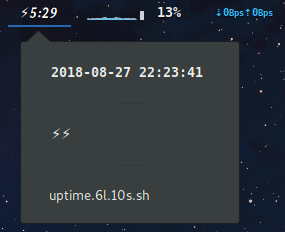
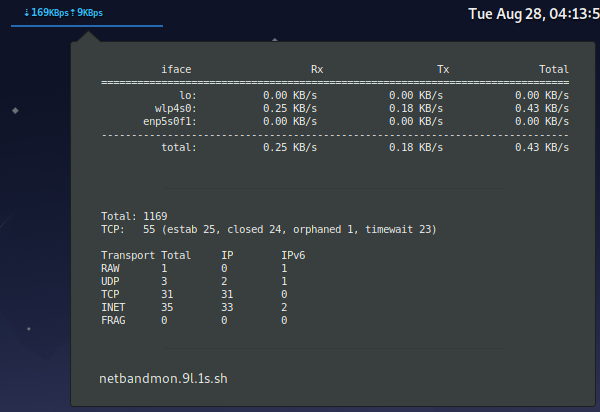

<h2>Scripts 4 Argos</h2>

A collection of scripts to be ran with the GNOME shell extension [Argos](https://github.com/p-e-w/argos).

<h3>Uptime indicator</h3>

<h3>Network & Bandwidth monitor</h3>

[Bandwidth Monitor NG](https://github.com/vgropp/bwm-ng) is needed as a dependency for the script to run.
